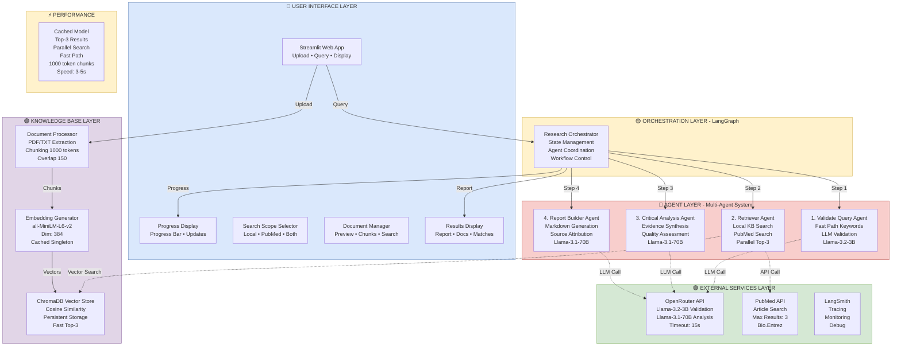

# MediScout System Architecture Diagram

## 📊 Visual Architecture (Mermaid Diagram)

**View this file in GitHub, VS Code (with Markdown Preview), or any Markdown viewer that supports Mermaid**



---

## 🏗️ System Architecture (Text Diagram)

```
┌─────────────────────────────────────────────────────────────────────────────┐
│                         🔵 USER INTERFACE LAYER                              │
│  ┌──────────┐  ┌──────────┐  ┌──────────┐  ┌──────────┐  ┌──────────┐    │
│  │Streamlit │  │ Progress │  │  Search  │  │Document  │  │ Results  │    │
│  │ Web App  │  │ Display  │  │  Scope   │  │ Manager  │  │ Display  │    │
│  └────┬─────┘  └─────▲────┘  └──────────┘  └──────────┘  └─────▲────┘    │
└───────┼─────────────┼─────────────────────────────────────────┼───────────┘
        │             │                                          │
        │Query        │Progress Updates                    Report│
        ▼             │                                          │
┌───────────────────────────────────────────────────────────────┼───────────┐
│               🟡 ORCHESTRATION LAYER (LangGraph)              │           │
│  ┌────────────────────────────────────────────────────────────┴─────────┐ │
│  │                    Research Orchestrator                            │ │
│  │           State Management • Agent Coordination                      │ │
│  │           Workflow Control • Error Handling                         │ │
│  └─────┬────────┬────────┬────────┬──────────────────────────────────┘ │
└────────┼────────┼────────┼────────┼────────────────────────────────────┘
         │        │        │        │
    Step1│   Step2│   Step3│   Step4│
         ▼        ▼        ▼        ▼
┌─────────────────────────────────────────────────────────────────────────┐
│                   🔴 AGENT LAYER (Multi-Agent System)                    │
│  ┌─────────┐  ┌─────────┐  ┌─────────┐  ┌─────────┐                   │
│  │Validate │  │Retriever│  │Critical │  │ Report  │                   │
│  │  Query  │  │  Agent  │  │Analysis │  │ Builder │                   │
│  │  Agent  │  │  Agent  │  │  Agent  │  │  Agent  │                   │
│  │         │  │         │  │         │  │         │                   │
│  │Fast Path│  │Local KB │  │Evidence │  │Markdown │                   │
│  │LLM Val. │  │+ PubMed │  │Synthesis│  │  Gen.   │                   │
│  │         │  │         │  │         │  │         │                   │
│  │Llama-3B │  │Top-3    │  │Llama-70B│  │Llama-70B│                   │
│  └────┬────┘  └────┬────┘  └────┬────┘  └─────────┘                   │
└───────┼────────────┼──────────────┼───────────────────────────────────┘
        │            │              │
        │LLM         │Vector Search │LLM
        │            │    +API Call │
        ▼            ▼              ▼
┌────────────────────────────────────┐  ┌────────────────────────────────┐
│  🟣 KNOWLEDGE BASE LAYER           │  │  🟢 EXTERNAL SERVICES          │
│  ┌──────────────────────────────┐ │  │  ┌──────────────────────────┐ │
│  │   Document Processor         │ │  │  │   OpenRouter API         │ │
│  │   • PDF/TXT Extraction       │ │  │  │   • Llama-3.2-3B (Val)  │ │
│  │   • Chunking (1000 tokens)   │ │  │  │   • Llama-3.1-70B (Ana) │ │
│  │   • Overlap: 150             │ │  │  │   • Timeout: 15s         │ │
│  └───────┬──────────────────────┘ │  │  └──────────────────────────┘ │
│          ▼                         │  │                                │
│  ┌──────────────────────────────┐ │  │  ┌──────────────────────────┐ │
│  │   Embedding Generator        │ │  │  │   PubMed API             │ │
│  │   • all-MiniLM-L6-v2        │ │  │  │   • Article Search       │ │
│  │   • Dimension: 384          │ │  │  │   • Max Results: 3       │ │
│  │   • Cached (Singleton)      │ │  │  │   • Bio.Entrez Client   │ │
│  └───────┬──────────────────────┘ │  │  └──────────────────────────┘ │
│          ▼                         │  │                                │
│  ┌──────────────────────────────┐ │  │  ┌──────────────────────────┐ │
│  │   ChromaDB Vector Store      │ │  │  │   LangSmith              │ │
│  │   • Cosine Similarity        │ │  │  │   • Tracing & Monitoring │ │
│  │   • Persistent Storage       │ │  │  │   • Debug Tools          │ │
│  │   • Fast Top-3 Retrieval     │ │  │  └──────────────────────────┘ │
│  └──────────────────────────────┘ │  │                                │
└────────────────────────────────────┘  └────────────────────────────────┘
```

---

## 🔄 Data Flow Sequence

### **1. Document Upload Flow**
```
User Upload (PDF/TXT)
    ↓
Document Processor (Extract Text)
    ↓
Text Chunking (1000 tokens, 150 overlap)
    ↓
Embedding Generator (all-MiniLM-L6-v2, cached)
    ↓
ChromaDB Vector Store (Store vectors with metadata)
```

### **2. Research Query Flow**
```
User Query
    ↓
Research Orchestrator (LangGraph State Machine)
    ↓
┌─ Step 1: Validate Query Agent
│  ├─ Fast Path: Check keywords (eye, document, medical, etc.)
│  ├─ If ambiguous: Call Llama-3.2-3B for validation
│  └─ Output: Validated + refined query
    ↓
┌─ Step 2: Retriever Agent (PARALLEL EXECUTION)
│  ├─ Thread 1: Search Local KB (ChromaDB, 1.5s timeout, Top-3)
│  └─ Thread 2: Search PubMed API (2.5s timeout, Top-3)
│  └─ Output: Combined 6 documents max
    ↓
┌─ Step 3: Critical Analysis Agent
│  ├─ Call Llama-3.1-70B
│  ├─ Synthesize evidence from all documents
│  └─ Output: Analysis results with key findings
    ↓
┌─ Step 4: Report Builder Agent
│  ├─ Call Llama-3.1-70B
│  ├─ Generate structured Markdown report
│  └─ Output: Final report with citations
    ↓
Display Results (Markdown + Retrieved Documents + Matching Sections)
```

### **3. Progress Updates (Real-time)**
```
Orchestrator
    ├─ 15%: Validating Query
    ├─ 40%: Deep Mining Knowledge
    ├─ 70%: Critical Analysis
    ├─ 95%: Compiling Report
    └─ 100%: Complete
         ↓
StreamlitCallbackHandler
         ↓
Progress Bar UI (Updates in real-time)
```

---

## 📊 Tech Stack Summary

| Layer | Technology | Details |
|-------|------------|---------|
| **Frontend** | Streamlit | Web UI, File Upload, Display |
| **Backend** | Python 3.11-3.13 | Core logic |
| **Orchestration** | LangGraph | Workflow state machine |
| **LLM Provider** | OpenRouter | Llama-3.2-3B, Llama-3.1-70B |
| **Vector DB** | ChromaDB | Persistent vector storage |
| **Embeddings** | sentence-transformers | all-MiniLM-L6-v2 (384 dim) |
| **External API** | PubMed | NCBI E-utilities (Bio.Entrez) |
| **Observability** | LangSmith | Tracing & monitoring |
| **Config** | Pydantic Settings | Type-safe env vars |
| **Processing** | pypdf, httpx | Document & API handling |
| **Logging** | Loguru | Structured logging |

---

## ⚡ Performance Optimizations

| Optimization | Impact | How |
|--------------|--------|-----|
| **Singleton Embedding Model** | -2-3s | Model cached globally |
| **Fast Path Validation** | -2-4s | Keyword-based skip LLM |
| **Faster LLM for Validation** | -1-2s | 3B instead of 70B model |
| **Top-3 Results Only** | -0.5s | 85% less data to process |
| **Parallel Search** | -1-2s | KB + PubMed simultaneous |
| **Larger Chunks** | -0.5s | 50% fewer chunks (1000 vs 500) |
| **Aggressive Timeouts** | -0.5s | 1.5s KB, 2.5s PubMed |
| **Total Speedup** | **7-12s** | From 10-15s → 3-5s |

---

## 📈 Key Metrics

- **End-to-End Speed**: 3-5 seconds (validated query)
- **Validation Time**: <1s (fast path) or 2-3s (LLM)
- **Retrieval Time**: 1.5s (local) + 2.5s (PubMed) = parallel
- **Results Per Source**: Top-3 (6 total max)
- **Chunk Size**: 1000 tokens with 150 overlap
- **Embedding Dimension**: 384
- **Model Loading**: Once per app lifecycle (cached)

---

## 🎯 Design Principles

1. **Speed First**: Aggressive caching and parallelization
2. **Modular**: Independent, testable agents
3. **Observable**: Full LangSmith tracing
4. **User-Friendly**: Real-time progress, clear feedback
5. **Flexible**: Multiple search modes
6. **Reliable**: Timeouts, error handling, fallbacks

---

## 📂 Key Files

```
src/mediscout/
├── config.py                  # Pydantic settings & env vars
├── state.py                   # LangGraph state definition
├── schemas.py                 # Data models (Document, Report, etc.)
├── orchestrator.py            # Workflow orchestration
├── knowledge_base.py          # Vector DB + embeddings (cached)
├── streamlit_callback.py      # Progress UI handler
├── agents/
│   ├── __init__.py
│   ├── validate_query.py      # Fast path + LLM validation
│   ├── retriever.py           # Parallel KB + PubMed search
│   ├── critical_analysis.py   # Evidence synthesis
│   └── report_builder.py      # Markdown generation
└── services/
    └── pubmed_client.py       # PubMed API client

main.py                        # Streamlit entry point
```

---

**💡 This Markdown file can be viewed directly in:**
- ✅ GitHub (Mermaid renders automatically)
- ✅ VS Code (Markdown Preview with Mermaid extension)
- ✅ Any Markdown viewer
- ✅ Plain text (ASCII diagrams work everywhere!)

