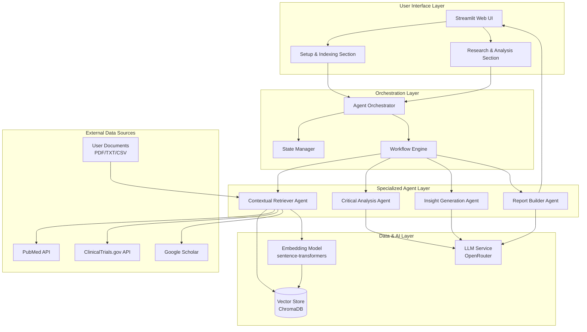
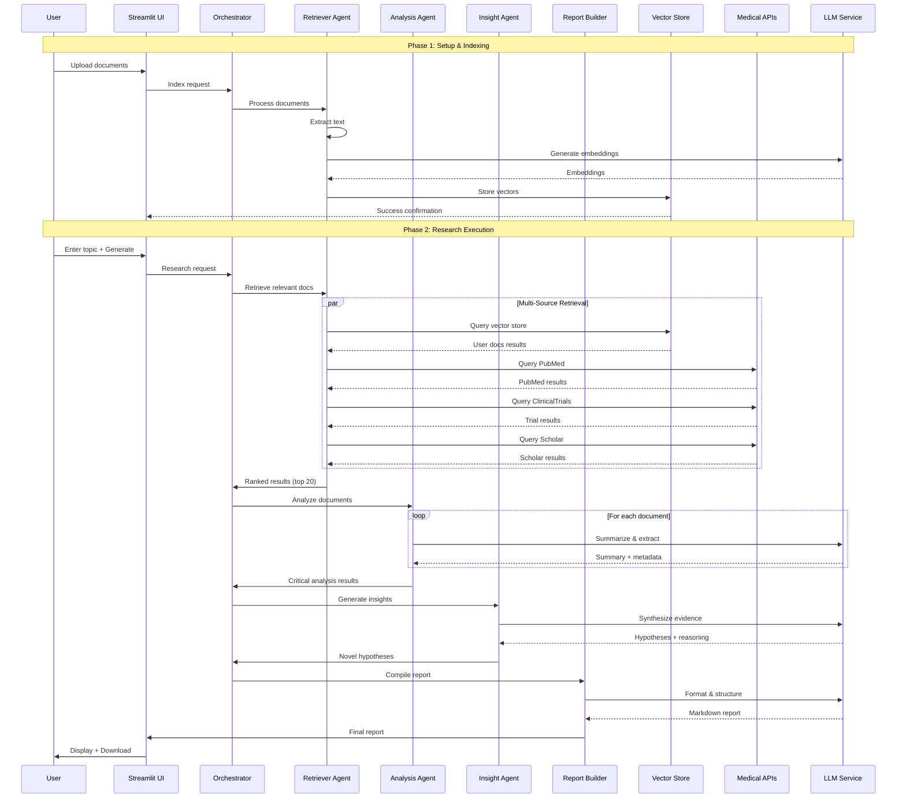

# AI Solution Architecture: MediScout - Multi-Agent AI Medical Researcher (MVP)

> High-level architecture for MediScout, a multi-agent AI system for automated medical research synthesis, critical analysis, and hypothesis generation.

---

## 1. Overview & Objectives

- **Project Name:** MediScout: Multi-Agent AI Medical Researcher
- **Date:** 2025-11-08
- **Prepared by:** Solution Architect (AI Persona) - Saro
- **Summary:**
	- MediScout is an intelligent multi-agent system that automates medical research workflows by ingesting user documents, querying medical APIs (PubMed, ClinicalTrials.gov, Google Scholar), performing critical analysis, and generating novel hypotheses. The system produces structured, evidence-based research reports with complete source citations, reducing literature review time from weeks to minutes.
- **Primary Business Objectives & KPIs:**
	- **Objective 1:** Reduce preliminary literature review time from days/weeks to < 15 minutes
	- **Objective 2:** Generate at least 1 novel, plausible hypothesis per research topic
	- **KPI 1:** Report generation time < 2 minutes for demo datasets
	- **KPI 2:** Retrieval precision@5 >= 0.6 for medical queries
	- **KPI 3:** 80%+ accuracy in identifying primary study outcomes

### Design Philosophy & Rationale

**Core Principles:**
1. **Open-Source First:** Prioritize free, permissive licenses to eliminate cost barriers and enable community contribution
2. **API-Agnostic LLM Access:** Use OpenRouter for unified access to multiple LLM providers without vendor lock-in
3. **Local-First Data:** Keep sensitive medical documents on local machines, never in cloud storage
4. **Modular Agent Design:** Each agent is independently testable and replaceable
5. **Cost Optimization:** Favor free-tier APIs and local models to minimize operational costs

**Why This Approach:**
- **Hackathon Constraints:** Fast iteration requires proven libraries with good documentation
- **Research Tool, Not Product:** MVP prioritizes functionality over production scalability
- **Educational Value:** Open-source stack allows learning and customization
- **Privacy:** Medical data sensitivity demands local storage and processing where possible

## 2. Solution Context

- **Problem Statement & Motivation:**
	- Medical researchers spend excessive time manually searching, collating, and analyzing information across fragmented sources
	- Existing tools lack the ability to integrate private knowledge bases with public medical databases
	- No automated system exists to identify hidden connections and generate data-driven hypotheses
	- Current systematic review processes take months and are prone to human oversight

- **Scope & Boundaries:**
	- **In Scope:** Document ingestion (PDF/TXT/CSV), vector embedding, multi-source retrieval (PubMed, ClinicalTrials.gov, Google Scholar), critical analysis, hypothesis generation, structured Markdown reports
	- **Out of Scope:** User authentication, OCR for scanned documents, non-English languages, real-time monitoring, production-grade UI, HIPAA compliance (MVP), direct medical advice

- **Primary Stakeholders:**
	- Medical Researchers (primary users)
	- Clinicians and Pharmaceutical R&D Teams (secondary users)
	- Hackathon Judges and Development Team

- **Key Assumptions & Constraints:**
	- Python 3.13+ environment available
	- Access to medical APIs (PubMed, ClinicalTrials.gov, Google Scholar)
	- LLM API access (OpenAI/Anthropic) with reasonable rate limits
	- Local deployment for MVP (user documents remain on local machine)
	- Demo-friendly performance (not production scale)

## 3. High-level Architecture Diagrams

### System Architecture Overview



### Data Flow Diagram: Research Workflow



## 4. Agentic System Design

### Agent Catalog

| Agent Name | Role | Responsibilities | Inputs | Outputs |
|------------|------|------------------|--------|---------|
| **Contextual Retriever Agent** | Data Acquisition | • Ingest user documents (PDF/TXT/CSV)<br>• Extract and chunk text<br>• Generate embeddings<br>• Query medical APIs<br>• Rank and merge results | Research topic, user documents, vector store | Top-K ranked documents with metadata (source, title, abstract, URL) |
| **Critical Analysis Agent** | Evidence Evaluation | • Summarize each document<br>• Extract study metadata (design, population, intervention, outcomes)<br>• Validate sources<br>• Identify contradictions<br>• Annotate reliability | Retrieved documents, research topic | Per-document summaries with critical annotations, contradiction flags |
| **Insight Generation Agent** | Hypothesis Formation | • Synthesize cross-source evidence<br>• Form reasoning chains<br>• Propose novel hypotheses<br>• Identify research gaps<br>• Assess evidence strength | Critical analysis results, research topic | 1-3 novel hypotheses with reasoning traces and supporting evidence |
| **Report Builder Agent** | Output Compilation | • Structure findings<br>• Format citations (AMA/Vancouver)<br>• Generate executive summary<br>• Compile final Markdown report<br>• Ensure traceability | Analysis results, insights, hypotheses | Structured Markdown report with all required sections |

### Orchestration Pattern

**Pattern:** Sequential Pipeline with Parallel Sub-Tasks

- **Orchestrator Role:** Centralized coordinator that manages agent lifecycle, state transitions, error handling, and progress tracking
- **Flow:**
	1. **Setup Phase:** User → UI → Orchestrator → Retriever (indexing only)
	2. **Research Phase:** User → UI → Orchestrator → Sequential agent pipeline (Retriever → Analysis → Insight → Report)
	3. **Parallel Operations:** Retriever executes multi-source API queries in parallel; Analysis agent processes documents in batches

- **Orchestration Framework:** LangGraph for agent workflow management with state persistence

### Communication & Protocols

- **Inter-Agent Communication:**
	- Structured Python objects passed via orchestrator (not direct agent-to-agent)
	- Standardized data contracts: `Document`, `AnalysisResult`, `Hypothesis`, `Report`
	- Typed schemas using Pydantic for validation

- **Error Handling:**
	- API failures: Retry with exponential backoff (3 attempts), graceful degradation if source unavailable
	- LLM failures: Fallback to simpler prompts, mark sections as "low confidence"
	- Parsing errors: Log and continue with partial results

- **State Management:**
	- Session state stored in Streamlit session
	- Intermediate results cached to avoid re-processing on failures
	- Progress updates emitted via orchestrator events

### Human-in-the-Loop (HITL) Points

1. **Document Upload Validation:** User reviews successfully indexed files
2. **Topic Refinement:** User can edit research topic before submission
3. **Report Review:** User reviews and validates generated hypotheses before use
4. **Future HITL (Out of MVP Scope):** Approval gates for hypothesis validation, source credibility rating

## 5. Data & Model Architecture (High-level)

### Data Sources & Ingestion

| Source | Type | Ingestion Method | Frequency | Retention |
|--------|------|------------------|-----------|-----------|
| User Documents | PDF/TXT/CSV files | File upload → text extraction | One-time/on-demand | Session-based (local disk) |
| PubMed | Medical literature API | REST API (Entrez) | Per-query | Response cached (5 min TTL) |
| ClinicalTrials.gov | Clinical trials API | REST API | Per-query | Response cached (5 min TTL) |
| Google Scholar | Academic search | Web scraping / API | Per-query | Response cached (5 min TTL) |

### Feature Stores / Data Stores

**Rationale for ChromaDB:**
- **Why ChromaDB over FAISS:**
	- **Metadata Filtering:** Native support for filtering by source, date, document type
	- **Persistence:** Built-in disk persistence without separate metadata management
	- **Developer Experience:** Simpler API, no need to manage index-to-metadata mapping
	- **Collections:** Logical grouping of documents by knowledge base
	- **Active Development:** Regular updates, better documentation
- **Trade-offs:**
	- Slightly slower than pure FAISS for large-scale deployments (not relevant for MVP)
	- Additional dependency, but lightweight (~50MB)

**Storage Implementation:**

- **Vector Store (ChromaDB):**
	- Stores: Document embeddings (384-dim vectors for efficiency), full metadata, document content
	- Persistence: SQLite-backed storage in `data/chromadb/` directory
	- Collections: One collection per knowledge base
	- Distance Metric: Cosine similarity (default)
	- Features Used: Metadata filtering, document upsert, collection management

- **Session State (Streamlit):**
	- Ephemeral storage for UI state, intermediate results, progress tracking
	- No persistent database for MVP

- **Document Cache (Redis-compatible, future):**
	- LRU cache for API responses to reduce redundant calls
	- MVP: Python dict with TTL (5 minutes)

### Model Roles & Placement

**Rationale for Model Selection:**
- **OpenRouter Strategy:**
	- **Why:** Unified API for 100+ models, no vendor lock-in, automatic failover
	- **Free Models:** Access to Llama 3.1, Mistral, Gemma without API keys
	- **Cost Control:** Pay-as-you-go, switch models instantly without code changes
- **Local Embeddings:**
	- **Why:** Zero cost, privacy-preserving, low latency
	- **Model Choice:** all-MiniLM-L6-v2 (80MB, 384-dim, excellent quality/speed trade-off)

| Model | Role | Provider | Placement | Context Window | Cost | Rationale |
|-------|------|----------|-----------|----------------|------|-----------|
| **Embedding Model** | Text → vector embedding | sentence-transformers (all-MiniLM-L6-v2) | Local | N/A | Free | Small model, fast inference, privacy-preserving |
| **LLM (Primary)** | Summarization, analysis, hypothesis generation | OpenRouter (Meta Llama 3.1 70B Instruct Free) | API | 128K tokens | Free | High quality, no rate limits, strong reasoning |
| **LLM (Fallback)** | Faster queries, drafts | OpenRouter (Google Gemma 2 9B Free) | API | 8K tokens | Free | Fast, efficient for simple tasks |
| **LLM (Alternative)** | Complex reasoning | OpenRouter (Mistral Large Free) | API | 128K tokens | Free | Strong medical domain knowledge |

### RAG / KB / Vector Strategy

- **Embedding Strategy:**
	- Chunk user documents into 500-token overlapping segments (100-token overlap)
	- Generate embeddings per chunk, store with metadata
	- Query-time: Embed research topic, retrieve top-20 chunks via cosine similarity

- **Retrieval Flow:**
	1. User submits research topic
	2. Embed topic using same model as indexing
	3. Query vector store → top-10 user document chunks
	4. Query medical APIs → top-10 results per source
	5. Merge and re-rank using hybrid scoring (semantic + keyword relevance)
	6. Return top-20 overall for analysis

- **Context Management:**
	- Analysis agent receives documents in batches (5 at a time) to avoid LLM context overflow
	- Insight agent receives pre-summarized evidence (not full documents)

## 6. Integration & APIs

### Internal APIs & Contracts

**Data Contracts (Pydantic Models):**

```python
class Document:
    id: str
    source: Literal["user", "pubmed", "clinicaltrials", "scholar"]
    title: str
    content: str
    metadata: Dict[str, Any]
    embedding: Optional[List[float]]

class AnalysisResult:
    document_id: str
    summary: str
    study_design: Optional[str]
    key_findings: List[str]
    reliability_score: float
    contradictions: List[str]

class Hypothesis:
    id: str
    statement: str
    reasoning_chain: List[str]
    supporting_evidence: List[str]  # document IDs
    confidence: Literal["low", "medium", "high"]

class Report:
    executive_summary: str
    methods: str
    detailed_findings: str
    contradictions: str
    hypotheses: List[Hypothesis]
    citations: List[str]
```

### External Integrations

**Integration Strategy Rationale:**
- **OpenRouter Choice:** Single API for multiple LLM providers, eliminates need for separate API key management
- **PubMed:** Official NIH API, reliable, well-documented, free tier sufficient
- **ClinicalTrials.gov:** Authoritative source for clinical trial data, JSON API
- **SerpAPI:** Paid but cheap ($0.05/search), fallback to manual Scholar queries if budget exhausted

| Integration | Protocol | Authentication | Rate Limits | Constraints | Why This Choice |
|-------------|----------|----------------|-------------|-------------|-----------------|
| **PubMed API (E-utilities)** | REST (HTTPS) | API Key (optional) | 3 req/sec (no key), 10 req/sec (with key) | Max 20 results per query | Official API, most reliable medical literature source |
| **ClinicalTrials.gov API** | REST (HTTPS) | None | ~1 req/sec (conservative) | Max 100 studies per query | Authoritative clinical trial registry, JSON responses |
| **SerpAPI (Google Scholar)** | REST (HTTPS) | API Key | 100 searches/month (free), 5K/month ($50) | Requires paid tier for production | Most comprehensive academic search, abstracts only |
| **OpenRouter** | REST (HTTPS) | API Key (free tier available) | Model-dependent (many models have no limits) | Free models have lower priority | Unified LLM access, automatic failover, no vendor lock-in |

## 7. Non-functional Architecture Considerations

### Scalability Approach

- **MVP:** Single-user, local deployment (no horizontal scaling needed)
- **Future:** 
	- Horizontal scaling via containerization (Docker) + Kubernetes
	- Separate agent services with load balancing
	- Distributed vector store (Pinecone, Weaviate)

### Reliability & Fault Tolerance

- **Retry Policies:**
	- API calls: 3 retries with exponential backoff (2s, 4s, 8s)
	- LLM calls: 2 retries, fallback to simpler model if persistent failure

- **Circuit Breakers:**
	- If external API fails 5 consecutive times, disable for 5 minutes and show warning

- **Graceful Degradation:**
	- Missing API sources: Continue with available data, annotate report with missing sources
	- LLM timeout: Return partial results with "incomplete" flag

### Performance & Latency Targets

| Operation | Target Latency (P95) | Notes |
|-----------|---------------------|-------|
| Document indexing (10 PDFs) | < 30 seconds | Depends on PDF size |
| Vector store query | < 500ms | Local FAISS |
| Single API query | < 3 seconds | Network-dependent |
| Per-document analysis | < 10 seconds | LLM call |
| Full report generation (20 docs) | < 2 minutes | End-to-end |

### Security & Compliance

- **Data Classification:**
	- User documents: Potentially sensitive (medical literature)
	- API responses: Public data, but aggregate insights may be sensitive

- **Encryption:**
	- At-rest: Local file system (OS-level encryption recommended)
	- In-transit: HTTPS for all API calls

- **Authentication/Authorization:**
	- MVP: No auth (single-user local app)
	- Future: OAuth 2.0, role-based access control

- **Audit Logging:**
	- Log all API calls, document uploads, and report generations with timestamps

## 8. Operational & MLOps Considerations

### Monitoring & Observability

**LangSmith Integration (Recommended):**
- **What:** LangChain's observability platform for tracing agent workflows
- **Why:** Visual debugging of agent chains, automatic cost tracking, prompt versioning
- **Usage:** Free tier available (5K traces/month), production tier for high volume
- **Key Features:**
  - Trace every LLM call with inputs/outputs
  - Visualize agent decision paths
  - Monitor token usage and costs in real-time
  - Debug failures with full context
  - Compare prompt versions A/B testing

**Setup:**
```bash
# Environment variables
LANGCHAIN_TRACING_V2=true
LANGCHAIN_API_KEY=your_langsmith_key
LANGCHAIN_PROJECT=mediscout-mvp
```

**Metrics to Track:**
- Request counts per agent
- API success/failure rates
- LLM token usage and cost (auto-tracked by LangSmith)
- End-to-end latency per research query
- Vector store query performance
- Agent success/failure rates (via LangSmith traces)

**Logging:**
- Structured JSON logs with request IDs (loguru)
- Log levels: DEBUG (development), INFO (production), ERROR (always)
- LangSmith traces complement logs with LLM-specific context

**Tracing:**
- LangSmith: Automatic tracing for LangChain/LangGraph components
- Correlation IDs: Track requests through agent pipeline
- Future: OpenTelemetry integration for non-LangChain components

### Model Lifecycle Management

- **Version Control:**
	- Pin embedding model version (e.g., `sentence-transformers==2.2.2`)
	- Track LLM model versions in config (e.g., `gpt-4-0125-preview`)

- **Model Updates:**
	- Embedding model changes require full re-indexing of vector store
	- LLM updates: A/B test on sample queries before switching

- **Rollback:**
	- Maintain previous embedding model and vector store snapshot for 1 week

### Incident Response & Runbooks

**Common Incidents:**

1. **LLM API Outage:**
	- Symptom: Report generation fails with API errors
	- Action: Check status page, switch to fallback provider, notify user of delay

2. **Vector Store Corruption:**
	- Symptom: Retrieval returns no results
	- Action: Reload from backup, re-index if necessary

3. **API Rate Limit Exceeded:**
	- Symptom: PubMed/Google Scholar queries fail
	- Action: Enable request throttling, increase backoff time, use cached results

## 9. Risk, Ethics & Governance

### Key Risks & Mitigations

| Risk | Impact | Probability | Mitigation |
|------|--------|-------------|------------|
| **LLM Hallucinations** | High (incorrect medical info) | Medium | Require source citations for all claims, add confidence scores, include disclaimer |
| **API Rate Limits** | Medium (incomplete data) | Medium | Implement caching, exponential backoff, multi-provider fallback |
| **Paywalled Sources** | Medium (missing literature) | High | Clearly mark unavailable sources, use abstracts where available |
| **Misinterpretation of Studies** | High (wrong conclusions) | Medium | Human validation required, emphasize hypothesis generation not clinical advice |
| **Data Privacy** | High (user doc leakage) | Low | Keep all data local, no cloud storage in MVP |
| **Cost Overruns (LLM)** | Low (budget) | Medium | Set token usage limits, use smaller models where possible |

### Ethics & Fairness Considerations

- **Bias Mitigation:**
	- Acknowledge potential biases in medical literature (e.g., underrepresentation of certain populations)
	- Flag when evidence base is limited or skewed

- **Explainability:**
	- Every hypothesis must include reasoning chain and source references
	- Provide confidence scores for all generated insights

- **Transparency:**
	- Clearly label AI-generated content
	- Include prominent disclaimer: "This tool is for research assistance only, not medical advice"

### Regulatory / Compliance Notes

- **MVP:** No regulatory compliance required (research tool, not medical device)
- **Future Considerations:**
	- HIPAA compliance if processing patient data
	- FDA oversight if used in clinical decision-making
	- GDPR compliance for EU users

## 10. Key Architectural Decisions (Decision Log)

| Decision ID | Date | Owner | Decision Summary | Rationale | Alternatives Considered | Impact |
|-------------|------|-------|------------------|-----------|------------------------|--------|
| **AD-001** | 2025-11-08 | Solution Architect | Use **ChromaDB** for vector store | **Why:** Built-in persistence, metadata filtering, simpler API than FAISS. **Thought Process:** MVP needs ease-of-use over max performance. ChromaDB's developer experience accelerates development. | FAISS (faster but complex metadata mgmt), Pinecone (cloud cost), Weaviate (overkill) | Faster development, slightly slower queries (acceptable for MVP) |
| **AD-002** | 2025-11-08 | Solution Architect | **OpenRouter** for LLM access | **Why:** No API key required for free models (Llama 3.1, Gemma 2), unified interface, automatic failover. **Thought Process:** Hackathon budget = $0. OpenRouter provides quality models without credit card. | Direct OpenAI (expensive), Anthropic (paid), Ollama (local but slow on laptops) | Zero LLM costs, vendor flexibility, slight latency overhead |
| **AD-003** | 2025-11-08 | Solution Architect | Sequential agent pipeline vs parallel | **Why:** Simpler orchestration, easier debugging. **Thought Process:** MVP prioritizes working demo over speed. Sequential = deterministic, easier to trace errors. | Parallel multi-agent (faster but complex coordination) | 2-min runtime acceptable for demo, reduced dev time |
| **AD-004** | 2025-11-08 | Solution Architect | **Streamlit** for UI | **Why:** 50 lines of code for full UI, Python-native, instant reload. **Thought Process:** Hackathon = speed. Streamlit eliminates frontend complexity. | Gradio (simpler but less control), Flask+React (production but slow dev) | Rapid prototyping, not production-grade (acceptable) |
| **AD-005** | 2025-11-08 | Solution Architect | **LangGraph** for orchestration | **Why:** Built for agent workflows, state management, LangChain ecosystem. **Thought Process:** Graph-based workflow = visual understanding, easy to extend agents. | CrewAI (higher abstraction, less control), AutoGen (research-focused, complex setup), raw LangChain (manual state mgmt) | Production-ready patterns, steeper learning curve but better long-term |
| **AD-006** | 2025-11-08 | Solution Architect | **Local embeddings** (sentence-transformers) | **Why:** Zero cost, privacy, 200ms latency. **Thought Process:** Embeddings called frequently. API costs add up. Local = predictable performance. | OpenAI embeddings (0.1¢/1K tokens × 100K tokens = $10/session), Cohere (similar cost) | Free, privacy-preserving, requires 1GB RAM |
| **AD-007** | 2025-11-08 | Solution Architect | **Python 3.13+** | **Why:** Latest features (better typing, faster), project requirement. **Thought Process:** New project = latest stable version. No legacy constraints. | Python 3.10 (wider compatibility) | Fastest performance, may limit some library compatibility (acceptable risk) |

## 11. Technology Stack & Licenses

### Complete Technology Stack with Rationale

#### Core Framework & Language

| Technology | Version | License | Purpose | Why Selected |
|------------|---------|---------|---------|--------------|
| **Python** | 3.13+ | PSF License (GPL-compatible) | Primary language | Strong AI/ML ecosystem, readable, fast iteration |
| **uv** | Latest | MIT / Apache 2.0 | Package manager | 10x faster than pip, modern dependency resolution |

#### Agent Orchestration & Workflow

| Technology | Version | License | Purpose | Why Selected |
|------------|---------|---------|---------|--------------|
| **LangGraph** | 0.2.0+ | MIT | Agent workflow orchestration | Purpose-built for multi-agent systems, state management, visual debugging |
| **LangChain** | 0.3.0+ | MIT | LLM integration framework | Industry standard, massive community, 500+ integrations |
| **LangSmith** | Latest | Proprietary (Free tier) | Observability & debugging | Essential for tracing agent workflows, automatic cost tracking, 5K traces/month free |
| **Pydantic** | 2.0+ | MIT | Data validation & schemas | Type-safe data models, automatic JSON serialization, excellent error messages |

**Rationale:** LangGraph over CrewAI (too opinionated) and AutoGen (research-focused, complex). LangChain provides abstractions without hiding complexity. LangSmith is optional but highly recommended for debugging complex agent chains.

#### LLM & Embeddings

| Technology | Version | License | Purpose | Why Selected |
|------------|---------|---------|---------|--------------|
| **OpenRouter** | Latest API | Proprietary (Free tier) | Unified LLM access | Access to 100+ models including free options (Llama 3.1, Gemma 2), no API key for free models, automatic failover |
| **sentence-transformers** | 2.2.0+ | Apache 2.0 | Local embedding generation | State-of-art embeddings, runs on CPU, privacy-preserving, zero cost |
| **transformers** (Hugging Face) | 4.35+ | Apache 2.0 | Model loading | Required by sentence-transformers, industry standard |
| **torch** | 2.1+ | BSD-3-Clause | ML backend | Required by sentence-transformers, optimized for inference |

**Specific Models:**
- **all-MiniLM-L6-v2** (80MB, 384-dim): Apache 2.0 - Fast, efficient, great quality/size ratio
- **Meta Llama 3.1 70B Instruct** (via OpenRouter): Llama 3.1 License (free for research) - Best reasoning, 128K context
- **Google Gemma 2 9B** (via OpenRouter): Gemma License (free) - Fast inference, good for summaries

**Rationale:** Local embeddings = $0 cost + privacy. OpenRouter free tier = no credit card required for hackathon.

#### Vector Database

| Technology | Version | License | Purpose | Why Selected |
|------------|---------|---------|---------|--------------|
| **ChromaDB** | 0.4.0+ | Apache 2.0 | Vector storage & similarity search | Simple API, built-in persistence, metadata filtering, SQLite-backed (no external DB needed) |
| **sqlite3** | 3.40+ | Public Domain | Backend for ChromaDB | Embedded database, zero configuration, included in Python |

**Rationale:** ChromaDB chosen over:
- FAISS: Faster but requires separate metadata management, more complex
- Pinecone: Cloud-only, costs money, vendor lock-in
- Weaviate: Requires Docker, overkill for MVP
- Milvus: Too heavy, production-focused

ChromaDB = Best developer experience for local-first MVP.

#### Web & UI Framework

| Technology | Version | License | Purpose | Why Selected |
|------------|---------|---------|---------|--------------|
| **Streamlit** | 1.28.0+ | Apache 2.0 | Web UI | 50 lines for full UI, Python-native, hot reload, perfect for demos |
| **Plotly** | 5.17+ | MIT | Interactive visualizations (future) | Rich charts, works with Streamlit |

**Rationale:** Streamlit over Gradio (less control) and Flask+React (too much frontend work).

#### Document Processing

| Technology | Version | License | Purpose | Why Selected |
|------------|---------|---------|---------|--------------|
| **pypdf** | 3.17.0+ | BSD-3-Clause | PDF text extraction | Pure Python, lightweight, handles 90% of PDFs |
| **pdfminer.six** | Latest | MIT | Fallback for complex PDFs | More robust parser for scanned/complex layouts |
| **python-docx** | 1.1.0+ | MIT | Word document processing (future) | Official Python library for .docx |
| **pandas** | 2.1+ | BSD-3-Clause | CSV/tabular data handling | Industry standard, excellent CSV support |

**Rationale:** pypdf first (lightweight), pdfminer.six fallback (robust but slower).

#### Medical API Clients

| Technology | Version | License | Purpose | Why Selected |
|------------|---------|---------|---------|--------------|
| **httpx** | 0.25.0+ | BSD-3-Clause | Async HTTP client | Modern, supports HTTP/2, better than requests for async |
| **biopython** | 1.81+ | BSD-3-Clause | PubMed API parsing | Official toolkit for bioinformatics, robust XML parsing |
| **serpapi** | Latest | MIT | Google Scholar scraping | Reliable API for Scholar, handles CAPTCHA, $0.05/search |

**Rationale:** httpx for all API calls (async = parallel requests). Biopython = battle-tested for PubMed.

#### Utilities & Helpers

| Technology | Version | License | Purpose | Why Selected |
|------------|---------|---------|---------|--------------|
| **tiktoken** | 0.5.0+ | MIT | Token counting | Official OpenAI tokenizer, accurate cost estimation |
| **python-dotenv** | 1.0.0+ | BSD-3-Clause | Environment variable management | Industry standard for .env files |
| **tenacity** | 8.2.0+ | Apache 2.0 | Retry logic for API calls | Exponential backoff, highly configurable |
| **loguru** | 0.7.0+ | MIT | Enhanced logging | Better than stdlib logging, readable output, automatic rotation |
| **pyyaml** | 6.0+ | MIT | Configuration files | Human-readable config format |

#### Testing & Development

| Technology | Version | License | Purpose | Why Selected |
|------------|---------|---------|---------|--------------|
| **pytest** | 7.4.0+ | MIT | Testing framework | Industry standard, excellent plugin ecosystem |
| **pytest-asyncio** | 0.21.0+ | Apache 2.0 | Async test support | Required for testing async agents |
| **pytest-mock** | 3.12+ | MIT | Mocking utilities | Easy mocking for external APIs |
| **black** | 23.9.0+ | MIT | Code formatter | Opinionated, eliminates style debates |
| **ruff** | 0.1.0+ | MIT | Fast linter | 100x faster than pylint, combines flake8+isort |
| **mypy** | 1.7.0+ | MIT | Static type checker | Catch type errors before runtime |

### License Summary

| License Type | Libraries | Commercial Use | Attribution Required | Copyleft |
|--------------|-----------|----------------|---------------------|----------|
| **MIT** | 15+ (majority) | ✅ Yes | ✅ Yes | ❌ No |
| **Apache 2.0** | 8 (LangChain, ChromaDB, etc.) | ✅ Yes | ✅ Yes | ❌ No |
| **BSD-3-Clause** | 5 (torch, pypdf, etc.) | ✅ Yes | ✅ Yes | ❌ No |
| **PSF License** | 1 (Python itself) | ✅ Yes | ✅ Yes | ❌ No |
| **Public Domain** | 1 (sqlite3) | ✅ Yes | ❌ No | ❌ No |

**Conclusion:** Entire stack is permissively licensed. No GPL/AGPL components. Safe for commercial use with attribution.

### Infrastructure & Deployment

| Technology | Version | License | Purpose | Why Selected |
|------------|---------|---------|---------|--------------|
| **Docker** (future) | 24.0+ | Apache 2.0 | Containerization | Standard for reproducible deployments |
| **GitHub Actions** (future) | N/A | Free for public repos | CI/CD | Native GitHub integration, free tier sufficient |

### Total Dependency Count

- **Core Dependencies:** 15
- **Dev Dependencies:** 6
- **Total Install Size:** ~2.5 GB (includes torch)
- **Disk Space (runtime):** ~500 MB (without torch models)

### Security & Compliance

| Tool | Purpose | License |
|------|---------|---------|
| **bandit** | Security linter for Python | Apache 2.0 |
| **safety** | Check for known vulnerabilities | MIT |
| **pip-audit** | Audit dependencies | Apache 2.0 |

### Thought Process Summary

**Key Principles:**
1. **Open-Source First:** All components permissively licensed (MIT/Apache/BSD)
2. **Zero Cost:** Favor free tiers and local execution (OpenRouter free models, local embeddings)
3. **Battle-Tested:** Prioritize mature libraries with active communities (LangChain, Streamlit, ChromaDB)
4. **Developer Experience:** Choose tools that accelerate development (Streamlit over React, ChromaDB over FAISS)
5. **No Vendor Lock-In:** OpenRouter = switch models instantly, ChromaDB = local storage, no cloud dependency

**Trade-Offs Accepted:**
- **Performance vs. Convenience:** ChromaDB slightly slower than FAISS, but easier to use (acceptable for MVP)
- **Latest Python:** 3.13 may have limited library support, but we want best performance
- **Free LLM Quality:** OpenRouter free models good but not GPT-4 level (acceptable for hackathon)

## 12. Open Questions & Next Steps

### Open Questions

1. **Q1:** ~~Which LLM provider should be primary?~~ **RESOLVED**
	- **Decision:** OpenRouter with Meta Llama 3.1 70B (free) as primary, Gemma 2 9B as fallback
	- **Rationale:** Zero cost, no API key needed, good quality

2. **Q2:** ~~Vector store choice?~~ **RESOLVED**
	- **Decision:** ChromaDB
	- **Rationale:** Simpler API, built-in persistence, better developer experience

3. **Q3:** What is the optimal chunk size and overlap for medical documents?
	- **Owner:** Python AI Developer
	- **Due Date:** During POC phase (Week 1)
	- **Impact:** Retrieval quality
	- **Hypothesis:** 500 tokens with 100 token overlap (based on literature review paper structure)

4. **Q4:** ~~Vector store persistence strategy?~~ **RESOLVED**
	- **Decision:** Persistent across runs using ChromaDB's disk-backed storage
	- **Rationale:** Better UX (no re-indexing), ChromaDB handles this natively

5. **Q5:** Should we use SerpAPI for Google Scholar or implement custom scraping?
	- **Owner:** Python AI Developer
	- **Due Date:** Sprint 1
	- **Impact:** Cost ($0.05/search) vs. reliability (scraping fragile)
	- **Recommendation:** Start with SerpAPI, implement scraping fallback if budget exceeded

### Next Steps

1. **Prototype Phase (Week 1):**
	- [ ] Set up Python project structure with `uv`
	- [ ] Implement document ingestion POC (PDF → text extraction)
	- [ ] Test embedding generation and vector store (FAISS)
	- [ ] Validate PubMed API integration

2. **Development Phase (Week 2):**
	- [ ] Implement all 4 agents (Retriever, Analysis, Insight, Report)
	- [ ] Build Streamlit UI (Setup + Research sections)
	- [ ] Integrate LangGraph orchestrator
	- [ ] End-to-end testing with sample medical topic

3. **Demo Preparation (Week 3):**
	- [ ] Prepare demo dataset (GIST example from PRD)
	- [ ] Performance optimization
	- [ ] Create demo script and talking points
	- [ ] Record demo video as backup

---

*This architecture document serves as the authoritative high-level design for MediScout. Implementation details should be captured in the Technical Design Document. Update this document as architectural decisions evolve.*

