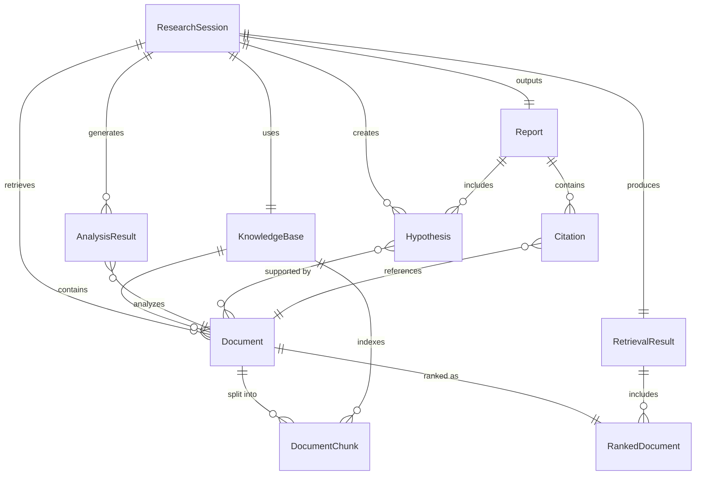

# Domain Model: MediScout - Multi-Agent AI Medical Researcher

> This document defines the core domain entities, their relationships, and business rules for the MediScout system.

---

## 1. Overview

The MediScout domain model captures the essential concepts in automated medical research synthesis. It defines the data structures, relationships, and constraints that govern how the system processes documents, generates insights, and produces research reports.

### Domain Context

- **Domain:** Medical Research Automation & Knowledge Synthesis
- **Bounded Context:** Multi-agent research workflow including document ingestion, retrieval, analysis, insight generation, and reporting
- **Core Responsibilities:** Manage research documents, track analysis workflows, generate evidence-based hypotheses

---

## 2. Core Domain Entities

### 2.1 Research Session

Represents a single research inquiry initiated by a user.

**Attributes:**
- `session_id`: str (UUID) - Unique identifier
- `topic`: str - Research question or topic
- `created_at`: datetime - Session creation timestamp
- `status`: SessionStatus - Current workflow state
- `user_id`: str (optional) - User identifier (future)
- `knowledge_base_id`: str - Reference to vector store
- `report`: Report (optional) - Final generated report

**States (SessionStatus Enum):**
- `INITIALIZING` - Session created, not yet processing
- `INDEXING` - Documents being indexed
- `RETRIEVING` - Querying data sources
- `ANALYZING` - Critical analysis in progress
- `GENERATING_INSIGHTS` - Hypothesis generation
- `BUILDING_REPORT` - Report compilation
- `COMPLETED` - Research complete
- `FAILED` - Error occurred

**Business Rules:**
- Session must have a non-empty topic
- Session can only transition forward through states (no backwards transitions)
- Failed sessions can be retried from last successful state

---

### 2.2 Document

Represents a single source document (user-provided or retrieved from external APIs).

**Attributes:**
- `document_id`: str (UUID) - Unique identifier
- `source`: DocumentSource - Origin of document
- `title`: str - Document title
- `authors`: List[str] - Document authors
- `abstract`: str - Document abstract/summary
- `content`: str - Full text content
- `publication_date`: date (optional) - Publication date
- `url`: str (optional) - External URL
- `doi`: str (optional) - Digital Object Identifier
- `metadata`: Dict[str, Any] - Additional metadata
- `chunks`: List[DocumentChunk] - Text chunks for embedding
- `created_at`: datetime - Ingestion timestamp

**Source Types (DocumentSource Enum):**
- `USER_UPLOAD` - User-provided document
- `PUBMED` - PubMed API
- `CLINICAL_TRIALS` - ClinicalTrials.gov
- `GOOGLE_SCHOLAR` - Google Scholar
- `MANUAL_ENTRY` - Manually entered text

**Business Rules:**
- Document must have either content or abstract
- Documents from external sources must have a URL
- Title is required for all documents
- User uploads must preserve original filename in metadata

---

### 2.3 DocumentChunk

Represents a segmented portion of a document for vector embedding.

**Attributes:**
- `chunk_id`: str (UUID) - Unique identifier
- `document_id`: str - Parent document reference
- `content`: str - Chunk text content
- `start_position`: int - Character offset in original document
- `end_position`: int - End character offset
- `token_count`: int - Number of tokens
- `embedding`: List[float] (optional) - Vector embedding
- `sequence_number`: int - Order in document

**Business Rules:**
- Chunk size: 500 tokens ± 50 tokens
- Overlap: 100 tokens with previous chunk
- Chunks must be processed in sequence order
- Embedding dimension must match model (768 for MiniLM)

---

### 2.4 KnowledgeBase

Represents the vector store containing indexed documents.

**Attributes:**
- `knowledge_base_id`: str (UUID) - Unique identifier
- `name`: str - Descriptive name
- `embedding_model`: str - Model used for embeddings
- `dimension`: int - Vector dimension
- `total_documents`: int - Document count
- `total_chunks`: int - Total chunk count
- `created_at`: datetime - Creation timestamp
- `last_updated`: datetime - Last modification
- `storage_path`: str - File system path to vector store

**Business Rules:**
- All documents in a knowledge base must use the same embedding model
- Changing embedding model requires full re-indexing
- Knowledge base must be persisted to disk after updates
- Maximum recommended size: 10,000 documents for MVP

---

### 2.5 RetrievalResult

Represents the outcome of querying multiple data sources for a research topic.

**Attributes:**
- `retrieval_id`: str (UUID) - Unique identifier
- `session_id`: str - Parent session reference
- `query`: str - Search query used
- `results`: List[RankedDocument] - Ranked document list
- `source_breakdown`: Dict[str, int] - Count per source
- `total_results`: int - Total documents retrieved
- `retrieval_time_ms`: int - Processing time
- `created_at`: datetime - Retrieval timestamp

**Business Rules:**
- Results must be ranked by relevance score
- Minimum relevance threshold: 0.4 (cosine similarity)
- Maximum results returned: 20 documents
- Must include at least one result to proceed to analysis

---

### 2.6 RankedDocument

Represents a document with relevance scoring.

**Attributes:**
- `document_id`: str - Reference to Document
- `rank`: int - Position in results (1-based)
- `relevance_score`: float - Similarity score (0.0-1.0)
- `ranking_method`: str - Algorithm used (e.g., "cosine_similarity", "hybrid")
- `matched_chunks`: List[str] - Chunk IDs that matched query

**Business Rules:**
- Relevance score must be between 0.0 and 1.0
- Rank must be unique within a RetrievalResult
- Documents ranked by score (descending)

---

### 2.7 AnalysisResult

Represents the critical analysis output for a single document.

**Attributes:**
- `analysis_id`: str (UUID) - Unique identifier
- `document_id`: str - Analyzed document reference
- `session_id`: str - Parent session reference
- `summary`: str - Document summary (200-300 words)
- `study_design`: StudyDesign (optional) - Type of study
- `population`: str (optional) - Study population description
- `intervention`: str (optional) - Intervention/treatment
- `outcomes`: List[str] - Primary outcomes identified
- `statistical_significance`: bool (optional) - P-value < 0.05
- `reliability_score`: float - Source reliability (0.0-1.0)
- `contradictions`: List[str] - Identified contradictions with other sources
- `key_quotes`: List[str] - Important excerpts
- `created_at`: datetime - Analysis timestamp

**Study Design Types (StudyDesign Enum):**
- `RANDOMIZED_CONTROLLED_TRIAL` - RCT
- `OBSERVATIONAL` - Observational study
- `CASE_STUDY` - Case study/report
- `META_ANALYSIS` - Meta-analysis
- `SYSTEMATIC_REVIEW` - Systematic review
- `LABORATORY` - Laboratory study
- `UNKNOWN` - Cannot determine

**Business Rules:**
- Summary must be concise (200-300 words)
- Reliability score based on: study design, sample size, publication venue, citation count
- RCTs receive higher reliability scores (0.8-1.0)
- Case studies receive lower reliability scores (0.3-0.5)

---

### 2.8 Hypothesis

Represents a novel hypothesis generated from synthesized evidence.

**Attributes:**
- `hypothesis_id`: str (UUID) - Unique identifier
- `session_id`: str - Parent session reference
- `statement`: str - Hypothesis statement (1-2 sentences)
- `reasoning_chain`: List[str] - Step-by-step reasoning
- `supporting_evidence`: List[str] - Document IDs supporting hypothesis
- `confidence_level`: ConfidenceLevel - Confidence assessment
- `research_gap`: str (optional) - Identified gap this addresses
- `testability`: str - How hypothesis could be tested
- `novelty_score`: float - Novelty assessment (0.0-1.0)
- `created_at`: datetime - Generation timestamp

**Confidence Levels (ConfidenceLevel Enum):**
- `LOW` - Speculative, limited supporting evidence
- `MEDIUM` - Plausible, some supporting evidence
- `HIGH` - Strong supporting evidence, well-reasoned

**Business Rules:**
- Must have at least 2 supporting documents
- Reasoning chain must have at least 2 steps
- Statement must be testable (falsifiable)
- Novelty score: higher if connecting disparate domains

---

### 2.9 Report

Represents the final structured research report.

**Attributes:**
- `report_id`: str (UUID) - Unique identifier
- `session_id`: str - Parent session reference
- `title`: str - Report title
- `executive_summary`: str - High-level summary (300-500 words)
- `research_topic`: str - Original research question
- `methods_section`: str - Methodology description
- `detailed_findings`: str - Comprehensive findings
- `contradictions_section`: str - Conflicting evidence
- `hypotheses`: List[Hypothesis] - Generated hypotheses
- `citations`: List[Citation] - Bibliography
- `metadata`: ReportMetadata - Report statistics
- `format`: ReportFormat - Output format
- `created_at`: datetime - Report generation timestamp

**Report Formats (ReportFormat Enum):**
- `MARKDOWN` - Markdown format (MVP)
- `PDF` - PDF format (future)
- `HTML` - HTML format (future)

**Business Rules:**
- Must include all required sections
- All claims must have citations
- Hypotheses ordered by confidence level (descending)
- Include disclaimer about research assistance purpose

---

### 2.10 Citation

Represents a bibliographic reference.

**Attributes:**
- `citation_id`: str (UUID) - Unique identifier
- `document_id`: str - Referenced document
- `citation_style`: CitationStyle - Format used
- `formatted_citation`: str - Formatted string
- `in_text_format`: str - In-text citation format

**Citation Styles (CitationStyle Enum):**
- `AMA` - American Medical Association (default)
- `VANCOUVER` - Vancouver style
- `APA` - APA 7th edition

**Business Rules:**
- Citations numbered sequentially in order of appearance
- Format must be consistent throughout report

---

### 2.11 ReportMetadata

Statistical metadata about a report.

**Attributes:**
- `total_documents_analyzed`: int
- `sources_breakdown`: Dict[str, int] - Count per source
- `date_range`: Tuple[date, date] (optional) - Publication date range
- `total_hypotheses`: int
- `processing_time_seconds`: int
- `token_usage`: Dict[str, int] - LLM token counts
- `cost_estimate`: float (optional) - Estimated API cost

---

## 3. Domain Relationships

### Entity Relationship Diagram

### Key Relationships

1. **ResearchSession → KnowledgeBase** (1:1)
   - Each session uses exactly one knowledge base
   - Knowledge base can be reused across sessions

2. **Document → DocumentChunk** (1:N)
   - One document split into multiple chunks
   - Chunks maintain sequence order

3. **RetrievalResult → RankedDocument** (1:N)
   - Result contains ranked list of documents
   - Same document can appear in multiple retrieval results

4. **AnalysisResult → Document** (N:1)
   - Each document gets one analysis per session
   - Analysis can be regenerated if needed

5. **Hypothesis → Document** (N:N)
   - Hypothesis supported by multiple documents
   - Document can support multiple hypotheses

6. **Report → Citation** (1:N)
   - Report contains bibliography of citations
   - Citations reference analyzed documents

---

## 4. Domain Services

### 4.1 DocumentIngestionService

**Responsibilities:**
- Extract text from PDF/TXT/CSV files
- Chunk documents into appropriate segments
- Generate embeddings for chunks
- Store in knowledge base

**Key Operations:**
- `ingest_document(file: UploadedFile) -> Document`
- `chunk_document(document: Document) -> List[DocumentChunk]`
- `embed_chunks(chunks: List[DocumentChunk]) -> List[DocumentChunk]`

---

### 4.2 RetrievalService

**Responsibilities:**
- Query vector store for relevant documents
- Execute external API queries (PubMed, ClinicalTrials, Scholar)
- Merge and rank results from multiple sources
- Apply relevance thresholds

**Key Operations:**
- `retrieve_documents(topic: str, knowledge_base: KnowledgeBase) -> RetrievalResult`
- `query_external_apis(topic: str) -> List[Document]`
- `rank_and_merge(results: List[Document], query_embedding: List[float]) -> RetrievalResult`

---

### 4.3 AnalysisService

**Responsibilities:**
- Summarize documents using LLM
- Extract study metadata
- Identify contradictions
- Assess source reliability

**Key Operations:**
- `analyze_document(document: Document, session: ResearchSession) -> AnalysisResult`
- `extract_study_metadata(document: Document) -> Dict[str, Any]`
- `detect_contradictions(analyses: List[AnalysisResult]) -> List[str]`

---

### 4.4 InsightGenerationService

**Responsibilities:**
- Synthesize evidence across documents
- Form reasoning chains
- Generate novel hypotheses
- Assess hypothesis confidence

**Key Operations:**
- `generate_hypotheses(analyses: List[AnalysisResult], topic: str) -> List[Hypothesis]`
- `build_reasoning_chain(hypothesis_statement: str, evidence: List[AnalysisResult]) -> List[str]`
- `assess_novelty(hypothesis: Hypothesis) -> float`

---

### 4.5 ReportBuildingService

**Responsibilities:**
- Compile findings into structured report
- Format citations consistently
- Generate executive summary
- Export to specified format

**Key Operations:**
- `build_report(session: ResearchSession, hypotheses: List[Hypothesis]) -> Report`
- `format_citations(documents: List[Document], style: CitationStyle) -> List[Citation]`
- `export_report(report: Report, format: ReportFormat) -> str`

---

## 5. Domain Invariants & Business Rules

### Global Invariants

1. **Traceability:** Every claim, hypothesis, or finding must reference source documents
2. **Consistency:** All embeddings within a knowledge base use the same model
3. **Auditability:** All operations timestamp and log for tracking
4. **Explainability:** Hypotheses must include reasoning chains
5. **Disclaimers:** Reports must include medical disclaimer

### Validation Rules

**Document Validation:**
- Title: Required, 1-500 characters
- Content or Abstract: At least one required, minimum 50 characters
- Authors: Optional, but recommended for credibility
- DOI/URL: Must be valid format if provided

**Session Validation:**
- Topic: Required, 10-500 characters
- Must reference existing knowledge base
- Cannot start retrieval without indexed documents

**Hypothesis Validation:**
- Statement: Required, 20-500 characters, must be interrogative or declarative
- Supporting evidence: Minimum 2 documents
- Reasoning chain: Minimum 2 steps
- Confidence must align with evidence strength

**Report Validation:**
- All sections must be non-empty
- Citation count must match referenced documents
- Hypotheses must be sorted by confidence (descending)

---

## 6. Domain Events

### Event Types

1. **DocumentIndexed**
   - Emitted when: Document successfully added to knowledge base
   - Payload: `document_id`, `knowledge_base_id`, `chunk_count`

2. **RetrievalCompleted**
   - Emitted when: All sources queried and results merged
   - Payload: `session_id`, `total_results`, `source_breakdown`

3. **AnalysisCompleted**
   - Emitted when: Document analysis finished
   - Payload: `analysis_id`, `document_id`, `reliability_score`

4. **HypothesisGenerated**
   - Emitted when: New hypothesis created
   - Payload: `hypothesis_id`, `confidence_level`, `supporting_doc_count`

5. **ReportGenerated**
   - Emitted when: Final report completed
   - Payload: `report_id`, `session_id`, `hypothesis_count`

6. **SessionFailed**
   - Emitted when: Session encounters unrecoverable error
   - Payload: `session_id`, `error_type`, `error_message`

---

## 7. Value Objects

### SearchQuery
- Immutable representation of a research query
- Contains: original query, expanded terms, filters

### RelevanceScore
- Immutable score with explanation
- Contains: score value, scoring method, contributing factors

### ReasoningStep
- Single step in hypothesis reasoning chain
- Contains: premise, evidence reference, logical operator, conclusion

### SourceProvenance
- Tracks document origin and reliability
- Contains: source type, retrieval date, reliability factors

---

*This domain model serves as the authoritative definition of MediScout's core concepts and should be referenced during implementation. Update this document as the domain understanding evolves.*

